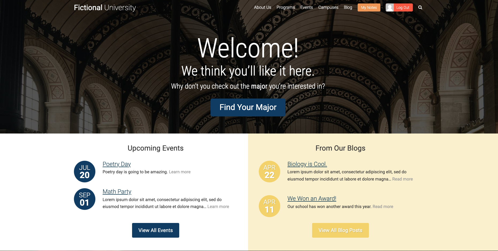

# WordPress Custom Theme Website

This is a Fictional University website built using the WordPress framework. The purpose of this project is to learn how to use WordPress as a true Content Management System and not just as a blog platform. By completing this project I learned the PHP language which runs WordPress, sharpened my REST API skills in order to interact with WordPress data in realtime, and I learned how to create custom post types, custom fields, and relationships between various content types.

## Features

- Search overlay: users can search for general info, programs, events, and professors
- Authentication: login and logout functionality
- Carousel using JavaScript
- My Notes: users can add notes, edit, and delete notes on the page

## Technologies Used

- HTML
- PHP
- CSS
- JavaScript
- WordPress
- Plugins
